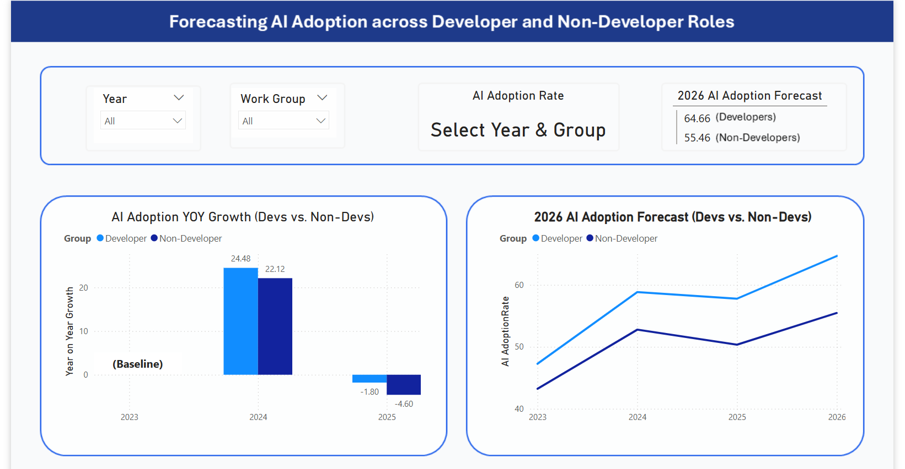

## 📊 Forecasting AI Adoption Across Developer and Non-Developer Roles

This project presents an end-to-end analysis of AI adoption trends, combining **data modeling, forecasting, and interactive visualization** to uncover how different roles engage with AI technologies.

The dashboard not only tracks historical adoption but also provides a forward-looking perspective, helping organizations understand where AI usage is heading and how to act on it.

---

## 🎯 Project Objectives

- Analyze AI adoption trends across roles  
- Compare developer vs non-developer adoption patterns  
- Identify the most impactful AI tools in use  
- Provide actionable recommendations for organizations  

---

## 📈 Dashboard Highlights

- **Trend & Forecast Analysis (2023–2026)**  
- **Year-on-Year Growth Breakdown**  
- **Interactive Role-Based Filtering**  
- **Top Non-Developer Roles by Adoption (2025)**  
- **AI Model Usage Across Roles**  
- **Insight-Driven Recommendation Page**

---

## 🧠 Key Takeaways

- Developers consistently show higher adoption rates, while non-developer adoption is steadily increasing  
- AI adoption growth peaked in 2024 before stabilizing  
- GPT-based tools are the most widely adopted across non-developer roles  
- Adoption success depends heavily on **ease of use and role alignment**

---

## 💡 Strategic Recommendations

- Focus AI investments on **usability and accessibility**  
- Standardize around **general-purpose AI tools**  
- Tailor AI solutions to **specific role needs**  

---

## 🛠️ Tech Stack

- **Power BI** (DAX, Data Modeling, Dashboard Design)  
- **Excel** (Data Preparation)

---

## 📸 Dashboard Preview

> *(Add screenshots of your dashboard here)*

